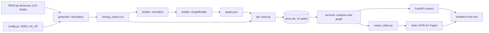
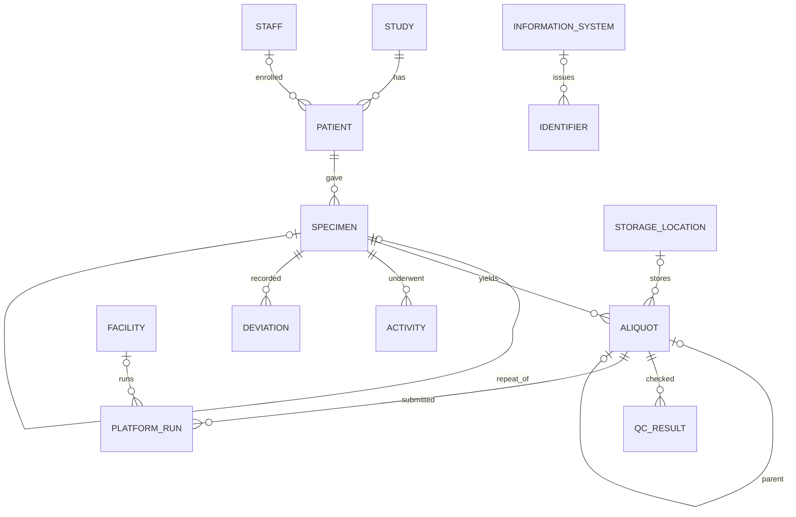
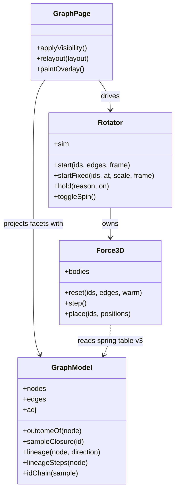
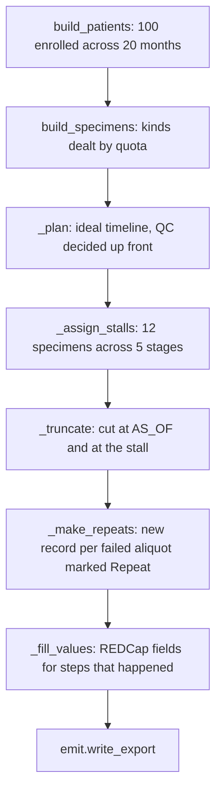
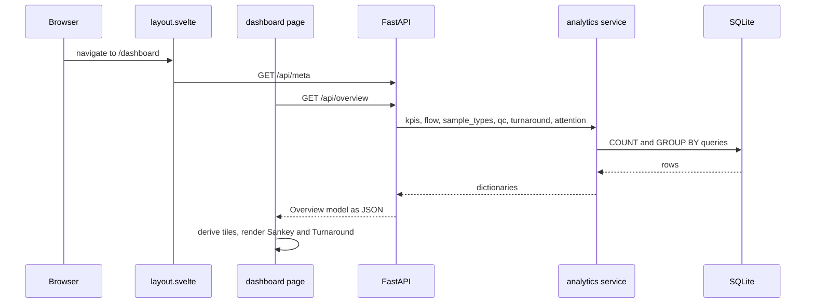
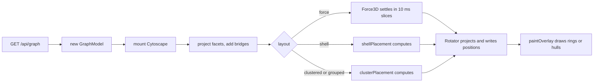
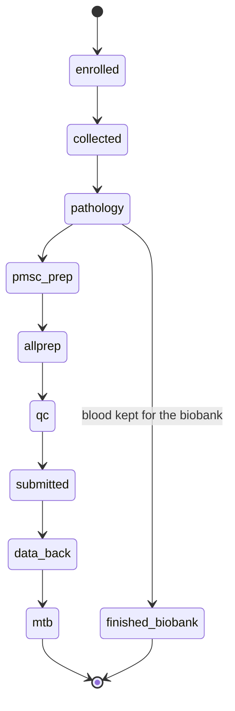

# Diagrams

## System Overview

The generator and the builder never meet the database, and the API never reads the export except for one field in the seeder. Replacing the generator with a live REDCap export changes only the leftmost box.

## Database Schema

The `identifier` table points at its owner through `owner_type` and `owner_id` rather than a foreign key, because an identifier can belong to a patient, a specimen or an aliquot. The `edge` table is not drawn, because it relates every table to every other through type-and-id pairs.

## Graph Payload Classes

## Generator Phases

The order matters. QC must be decided before the timeline is cut, because a failed aliquot is never submitted and so has no later dates to cut.

## Request Flow: Opening the Dashboard

## Graph View: From Payload to Frame

## Specimen Stage State

A specimen whose last step is older than thirty days, and which still has an open stream, is flagged as stalled at whichever of these states it stopped in.
